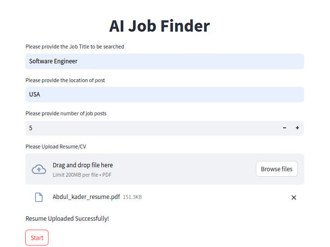
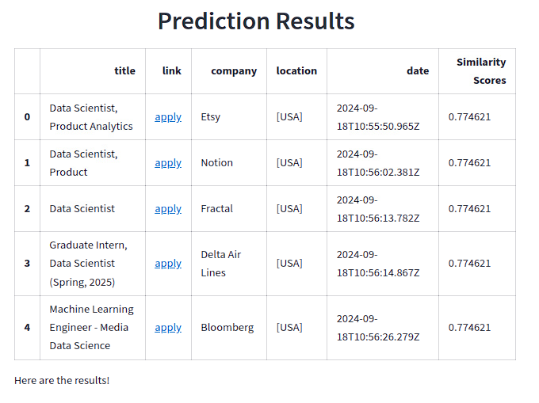

# AI-Job-Finder

## Overview

AI-Job-Finder is an open-source project aimed at simplifying the job search and application process in the IT sector. With this web app, you can effortlessly retrieve job listings in your field of interest, complete with all details, see how much your CV matches with each job listing, and apply directly to the job through the provided links.


## Developer Guide

### Step 1: Clone the Repository

First, clone the repository to your local machine using the command:

```bash
git clone https://github.com/Abdulkadir19997/AI-Job-Finder.git
```

### Step 2: Create Python Environment

Inside the downloaded 'AI-Job-Finder' folder, create a Python environment. For example, to create an environment named 'job_finder', use:

```bash
python -m venv job_finder
```

### Step 3: Activate Environment

Activate the environment with:

```bash
.\job_finder\Scripts\activate
```
s
### Step 4: Install Requirements

After confirming that the job_finder environment is active, install all necessary libraries from the 'requirements.txt' file:

```bash
pip install -r requirements.txt
```

### Step 5: Run the Streamlit Application

In the active 'job_finder' environment, run the 'front_end.py' file with:

```bash
streamlit run front_end.py
```

### Step 6: Open a New Terminal Session

Open a new terminal inside the 'AI-Job-Finder' folder and activate the 'job_finder' environment again:

```bash
.\job_finder\Scripts\activate
```

### Step 7: Run FastAPI

In the second terminal with the 'job_finder' environment active, start the FastAPI service with:

```bash
uvicorn main:app --reload
```

### Step 8: Start the Application

Fill in the required fields and hit the start button to gather all the job listings for the specified job title and location, sorted by match scores against your uploaded CV.



### Step 9: Apply to Jobs

Jobs are listed from highest to lowest match scores. Apply to the job of interest by clicking on the "apply" button.



## Notes
To run locally, operate two different terminals each time: one with the 'job_finder' environment to run 'streamlit run front_end.py', and another to execute 'uvicorn main:app --reload'.

